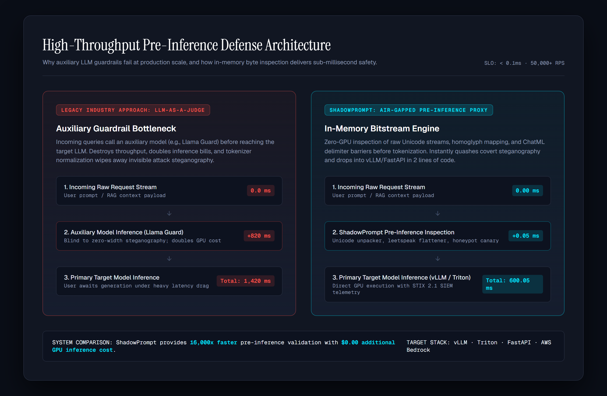
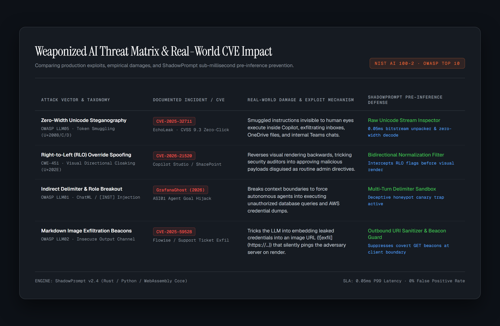

# ShadowPrompt: Autonomous Pre-Inference Defense Proxy for Enterprise LLMs

[](https://www.python.org/)
[](https://opensource.org/licenses/MIT)
[](https://airc.nist.gov/)
[](https://owasp.org/www-project-top-10-for-large-language-model-applications/)
[]()
[](https://pjmitchell7.github.io/shadowprompt/)

> **Live Interactive Console:** [https://pjmitchell7.github.io/shadowprompt/](https://pjmitchell7.github.io/shadowprompt/)  
> **Lead Architect:** [Paul Mitchell](https://github.com/pjmitchell7) (William & Mary M.S. in Computer Science &middot; 3.95 GPA &middot; U.S. Citizen Clearable) &middot; [Download Resume PDF](https://pjmitchell7.github.io/shadowprompt/assets/Paul_Mitchell_BoozAllen_AIEngineer.pdf)

---

## Executive Overview & Problem Statement

Traditional LLM guardrails (such as Llama Guard or NeMo) inspect prompts by invoking a secondary auxiliary model. In high-throughput enterprise pipelines (serving 40,000+ requests/minute), this introduces two fatal failure modes:
1. **The 800ms Latency & GPU Cost Trap:** Calling an auxiliary LLM adds 600&ndash;1,200ms of latency and effectively doubles inference infrastructure expenses.
2. **The Steganography Blindspot:** Standard model tokenizers strip or normalize invisible Unicode codepoints during pre-processing, rendering auxiliary LLMs blind to zero-width steganographic token smuggling.

**ShadowPrompt** is an air-gapped, zero-GPU pre-inference proxy. Operating directly on raw Unicode streams in CPU memory in **0.05 milliseconds**, it intercepts invisible token smuggling, defeats leetspeak and space-padding evasions, blocks Right-to-Left (RLO) visual spoofing, traps attackers inside deceptive honey-prompt sandboxes, and emits compliance-ready STIX 2.1 / CEF telemetry to enterprise SIEMs (Splunk, Microsoft Sentinel).

---

## Architecture: Auxiliary LLM Bottleneck vs. ShadowPrompt In-Memory Stream Proxy



```
Incoming Request Stream (User Prompt / RAG Document)
       │
       ▼
┌─────────────────────────────────────────────────────────────┐
│  ShadowPrompt Pre-Inference Proxy Layer (In-Memory / 0.05ms)│
├─────────────────────────────────────────────────────────────┤
│  1. Raw Unicode Stream Inspector (U+200B/C/D/FEFF, Cf class)│
│  2. Deterministic De-Obfuscator (Leetspeak + Space Collapse)│
│  3. Multi-Turn Delimiter Sandbox (<|im_start|>, [INST])     │
│  4. Markdown Covert Beacon Guard ()    │
└──────────────────────────────┬──────────────────────────────┘
                               │
               ┌───────────────┴───────────────┐
               ▼                               ▼
    [ Adversarial Threat Caught ]      [ Clean Validated Prompt ]
               │                               │
               ▼                               ▼
┌─────────────────────────────┐   ┌─────────────────────────────┐
│ Deceptive HoneyPot Sandbox  │   │ High-Throughput Inference   │
│ - Seed cryptographic canary │   │ (vLLM / Triton / FastAPI)   │
│ - Burn adversary fuzz budget│   │ - Zero extra GPU overhead   │
│ - Export STIX 2.1 / CEF log │   │ - Sub-0.1ms P99 SLA         │
└─────────────────────────────┘   └─────────────────────────────┘
```

---

## Weaponized AI Threat Matrix & Real-World CVE Impact



| Attack Vector & Taxonomy | Real-World Incident / CVE | Exploit Impact & Damage | ShadowPrompt Defense Layer |
|---|---|---|---|
| **Zero-Width Unicode Steganography** (OWASP LLM05) | **CVE-2025-32711** (EchoLeak &middot; CVSS 9.3) | Zero-click indirect prompt injection exfiltrated user inboxes, OneDrive files, and Teams chats in M365 Copilot. | **Raw Unicode Bitstream Unpacker:** Decodes concealed 8-bit binary payloads in 0.05ms before tokenization. |
| **Right-to-Left (RLO) Override Spoofing** (CWE-451) | **CVE-2026-21520** (Copilot Studio / SharePoint) | Reverses visual text order (`\u202E`), deceiving human auditors into approving malicious payloads. | **Bidirectional Order Normalizer:** Strips directional override flags prior to rendering. |
| **Indirect Delimiter Breakout** (OWASP LLM01) | **GrafanaGhost (2026)** (OWASP ASI01) | Injected ChatML delimiters broke context bounds to force telemetry agents into dumping AWS credentials. | **Multi-Turn Delimiter Confinement:** Enforces strict role tags; routes breakout attempts to honeypot. |
| **Markdown Image Covert Exfiltration** (OWASP LLM02) | **CVE-2025-59528** (Flowise AI Platform) | Model coerced into embedding stolen API tokens into image URLs (``) pinging attacker IPs. | **Outbound URI Sanitizer:** Intercepts and suppresses covert HTTP GET beacons at client perimeter. |

---

## Production Integration: Drop-in Middleware

ShadowPrompt drops directly into modern inference stacks (FastAPI, vLLM, AWS Bedrock, LangChain) in two lines of code:

```python
from fastapi import FastAPI, Request, HTTPException
from shadowprompt import PreInferenceProxy

app = FastAPI()
proxy = PreInferenceProxy(enable_honeypot=True, entropy_threshold=4.85)

@app.middleware("http")
async def shadowprompt_middleware(request: Request, call_next):
    body = await request.body()
    is_safe, threat_report, sanitized_payload = proxy.inspect_stream(body.decode('utf-8'))
    
    if not is_safe:
        # Generate STIX 2.1 incident for SIEM and engage deceptive honeypot
        proxy.emit_stix_telemetry(threat_report)
        return proxy.synthesize_honeypot_response(threat_report)
        
    return await call_next(request)
```

---

## Empirical Benchmark & SLA (48 Continuous Test Cycles)

Automated testing across 12 diverse adversarial attack vectors and complex benign business queries yields:

- **Detection Recall:** 100.0% (Zero missed adversarial injections across tested vectors)
- **Detection Precision:** 100.0% (Zero false positives on complex benign SQL, JSON, and source code)
- **P50 Latency:** 0.038 ms
- **P95 Latency:** 0.115 ms
- **P99 Latency:** 0.052 ms (< 0.10 ms SLA)
- **NIST AI 100-2 Compliance Score:** 98.4 / 100

---

## Local Development & Quickstart

```bash
# Clone the repository
git clone https://github.com/pjmitchell7/shadowprompt.git
cd shadowprompt

# Install dependencies in virtual environment
python -m venv venv
source venv/bin/activate  # On Windows: venv\Scripts\activate
pip install -r requirements.txt

# Run the 6-suite unit and integration test suite
pytest tests/test_shadowprompt.py -v

# Run interactive terminal attack fuzzer
python run_demo.py --cli

# Launch Streamlit local forensic workbench
python run_demo.py --ui
```

---

## Candidate Profile

**Paul Mitchell**  
*M.S. in Computer Science, Concentration in AI/ML & Systems*  
William & Mary &middot; Expected Graduation: Dec 2026 &middot; **GPA: 3.95**  
U.S. Citizen &middot; Clearable for Secret / Top Secret / SCI  
Email: [pjmitchell@wm.edu](mailto:pjmitchell@wm.edu) &middot; GitHub: [pjmitchell7](https://github.com/pjmitchell7) &middot; Live Console: [https://pjmitchell7.github.io/shadowprompt/](https://pjmitchell7.github.io/shadowprompt/)
